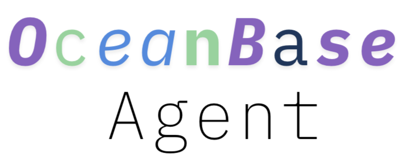

<div align="center">
  
</div>

<p align="center">
  <a href="https://github.com/xataio/agent/blob/main/LICENSE"></a>&nbsp;
  <a href="https://github.com/xataio/agent/actions?query=branch%3Amain"></a> &nbsp;
  <a href="https://xata.io/discord"></a> &nbsp;
  <a href="https://twitter.com/xata"> </a>
</p>

# Introduce

This project was modified from the [xata agent project](https://github.com/xataio/agent).

## Installation / self-hosted

We provide docker images for the agent itself. The only other dependency is a Postgres database in which the agent will store its configuration, state, and history.

We provide a docker-compose file to start the agent and the Postgres database.

Edit the `.env.production` file in the root of the project. If you are not using the official API addresses of Openai, Deepseek, Anthropic, or Gemini, you need to add the configurations of CUSTOM_BASE_URL, CUSTOM_API_KEY, and CUSTOM_CHAT_MODEL_NAME.

Start a local instance via docker compose:

```bash
docker compose up or docker-compose up
```

Open the app at `http://localhost:8000` (or the public URL you set in the `.env.production` file) and follow the onboarding steps.

We have a more detailed [guide](https://github.com/xataio/agent/wiki/Xata-Agent-%E2%80%90-Deploy-on-EC2) on how to deploy via docker-compose on an EC2 instance.

For authentication, you can use your own OAuth provider.

## Development

Go to the `apps/dbagent` directory and follow the instructions in the [README](./apps/dbagent/README.md).

## Extensibility

The agent can be extended via the following mechanisms:

- **Tools**: These are functions that the agent can call to get information about the database. They are written in TypeScript.
- **Playbooks**: These are sequences of steps that the agent can follow to troubleshoot an issue. They are simply written in english.
